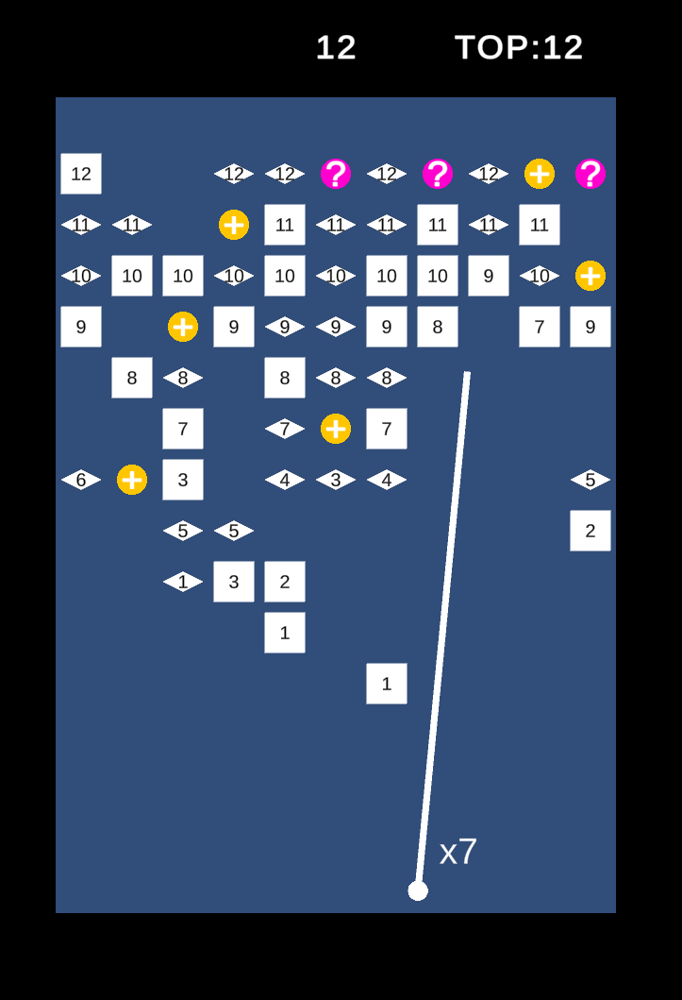

# BBTAN

复刻经典游戏《BBTAN》，用来练手的游戏项目，没有完全复刻所有功能。

## 目录结构

### Assets/Naive

不使用框架，使用最原始、最快速的方法，实现 BBTAN。
所以代码架构非常辣鸡，作为反面教材，我自己都看不下去，不想继续维护的那种。

### Assets/MVC

使用 MVC 的思路（+其他一些思路），实现 BBTAN，代码可读性、项目可维护性好一些

## 学习资料

- [我自己的博客](https://discretetom.github.io/posts/game-client-architecture/)
- [杰克有茶 大佬的单体应用教程](https://www.bilibili.com/video/BV1JB4y1S7hk)
- [凉鞋 大佬的游戏框架搭建教程](https://www.bilibili.com/video/BV1vg411g7Fn)
